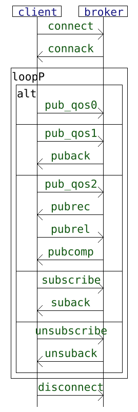
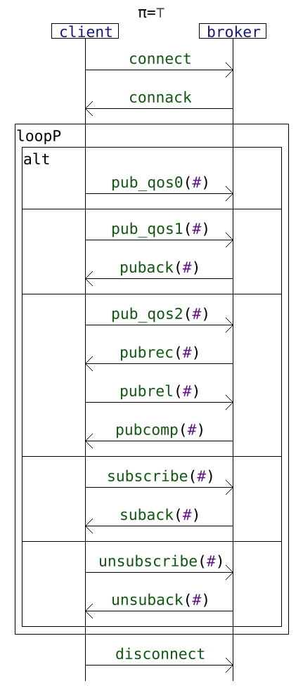
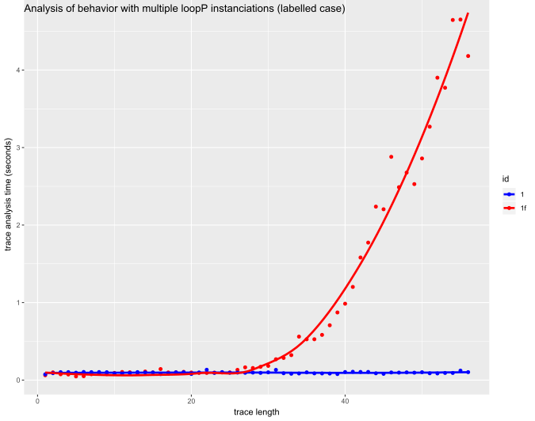
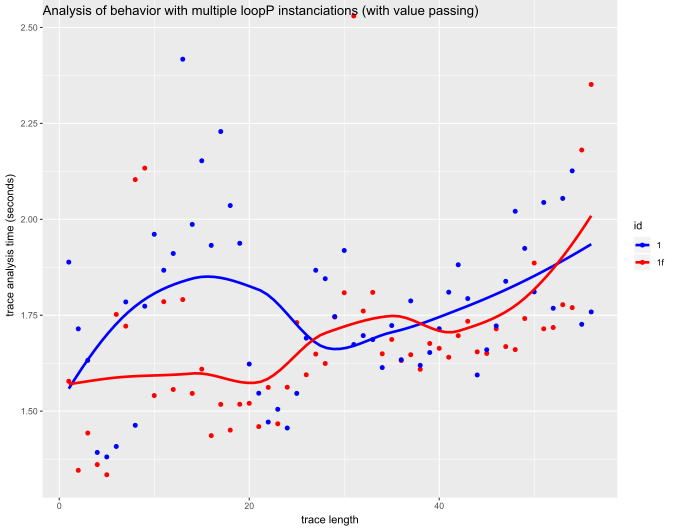
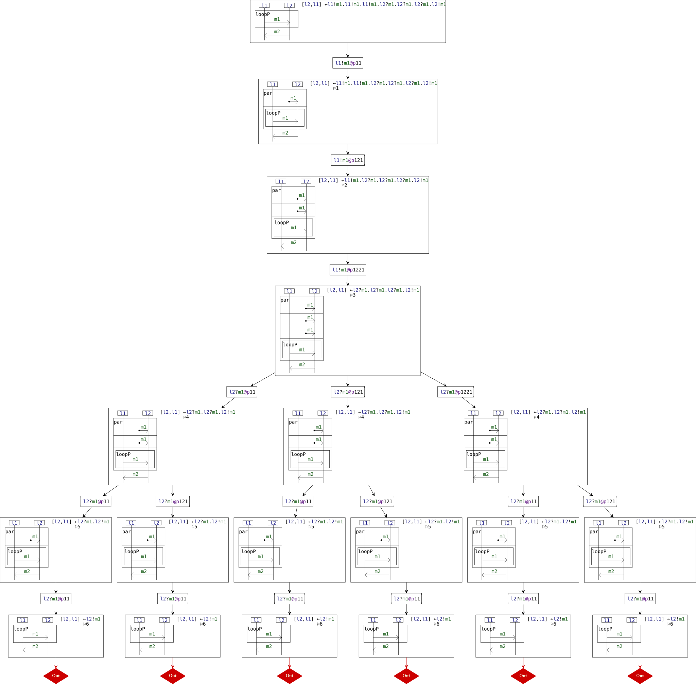
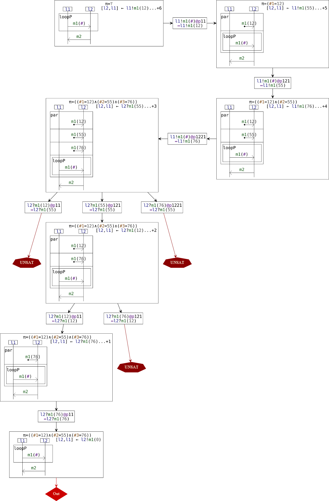

# A small experiment on testing a client-broker system communicating with MQTT using HIBOU

This example is provided as an example aimed at explaining the advantage of considering value passing over the use of simple labelled message.

See "[hibou_label](https://github.com/erwanM974/hibou_label)" and "[hibou_efm](https://github.com/erwanM974/hibou_efm)" for the tools that are used.

## Input models

We define an abstract "labelled" interaction model describing MQTT communications between a "client" and a "broker" as follows:

We define a variant of that interaction model enriched with value passing as follows:

## Benchmark

We use a configurable multithreaded Python script to generate traces that could be obtained from an implementation of that client-broker system.
The script generates correct traces and all the prefixes of those traces.
It also generates mutants that correspond to the addition of an unexpected event
at the end of each correct trace and of all its prefixes.
Those mutant are, by construction, guaranteed to correspond to traces that are not accepted nor are they prefixes of accepted traces.

For each of those three kinds of traces (accepted, prefix and non-conform mutant), two variants are defined:
(1) a "labelled" variant without typed parameters associated to the messages i.e. the MQTT messages that are exchanged are simple labels
and (2) a variant "with data", with the unique MQTT message identifiers being taken into account when abstracting the exchanged information.

Then, the "labelled" traces are analyzed against the "labelled" interaction model and the traces "with data" are analyzed against the "symbolic" interaction model. Plotting the time of the analysis yields the following results:

The blue curve corresponds to the analysis of correct traces and their prefixes.
The red curve corresponds to the analysis of non-conform mutants of various sizes.

We can see that, in the labelled case, there is an exponential increase in the time complexity when analyzing non-conform mutants, which is not the
case in the symbolic case. We briefly explain the reason why in the following.

## Reasons for the shapes of the curves

It suffices to consider the simple example below:

We can see that, given that the three instances of the reception event "l2?m1" are indistinguihsable, the analysis must explore all possibilities so as to make sure that the trace is non-conform.

By contrast, when considering an interaction model enriched with data, the reception events "l2?m1(12)", "l2?m1(55)" and "l2?m1(76)" become distinguishable and the size of the graph that needs to be explored to prove non-conformance is reduced. This reduction in size is exponential with the number of successive emissions of "m1" which exactly mitigates the aformentioned exponential increase in the labelled case.

